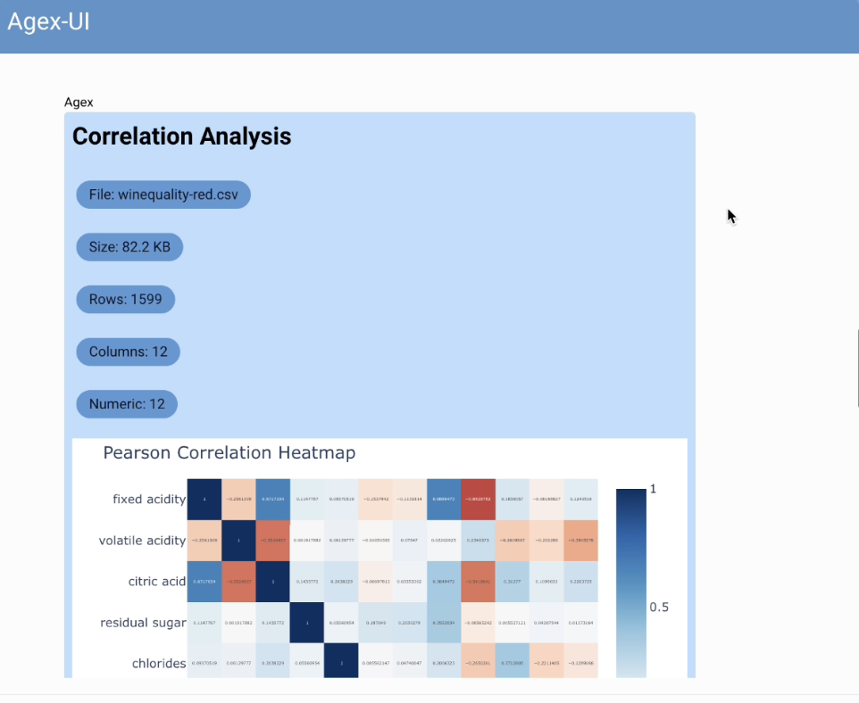

# agex-ui: Agent-Driven UIs with NiceGUI

This repository demonstrates how the [`agex`](https://github.com/ashenfad/agex) framework can be used to create dynamic, agent-driven user interfaces with [NiceGUI](https://nicegui.io/).

[](https://youtu.be/kR8tGD0N28Y)

The core concept is to give an AI agent direct, sandboxed access to the NiceGUI library, allowing it to build and modify a user interface at runtime in response to natural language prompts.

## The Technical Approach: Bypassing the Tool-Layer

Most agentic frameworks rely on a "tool-layer" abstraction. To allow an agent to build a UI, a developer would need to write explicit wrapper functions (tools) with rigid JSON schemas for every UI component they want the agent to use:

```python
# Traditional approach: A predefined, rigid tool
@agent.tool
def create_button(text: str, color: str, on_click_handler: str):
    """Creates a button with limited, predefined options."""
    # ... logic to create a button from JSON ...
    pass
```

This approach requires the agent's behavior to be anticipated and constrained by the predefined parameters of the tool schema.

`agex` takes a different approach by providing the agent with direct, runtime access to Python libraries. Instead of defining tools, you register the `nicegui` module itself. The agent then writes Python code to call the NiceGUI API directly, giving it access to the full capabilities of the library:

```python
# (Code an agex agent might generate)

with inputs.col:
    ui.label("Custom Analysis").classes("text-2xl")

    # The agent has access to any NiceGUI component and configuration
    data_input = ui.input("Enter data source")
    chart_type = ui.select(["bar", "line", "pie", "scatter"])
    
    # The agent can compose components and lambda functions
    ui.button("Generate", on_click=lambda: form_submit({
        'data': data_input.value,
        'chart': chart_type.value
    }))

task_success()
```

This allows the agent to combine components, create layouts, and handle interactions in ways not predefined by the developer, enabling novel UI structures at runtime.

## Included Demos

This repository contains two working examples:

1.  **Interactive Chat UI (`agex_ui/chat`)**: A chat interface where an agent builds and renders UI components (forms, buttons, etc.) directly into the conversation. These components can act as forms, providing structured data back to the agent upon submission for subsequent actions.
2.  **Dynamic Page Generation (`agex_ui/lorem_ipsum`)**: A web server that uses an agent to dynamically generate entire pages on the fly for any visited URL (e.g., `/dashboard`, `/profile`), complete with layouts and data visualizations.

## Running the Demos

First, set up the environment:

```bash
# Create and activate a virtual environment
python -m venv .venv
source .venv/bin/activate

# Install the project and its dependencies
pip install -e ".[dev]"
```

Then, run one of the examples:

```bash
# To run the chat interface
python -m agex_ui.chat.main

# To run the dynamic page generator
python -m agex_ui.lorem_ipsum.main
```
